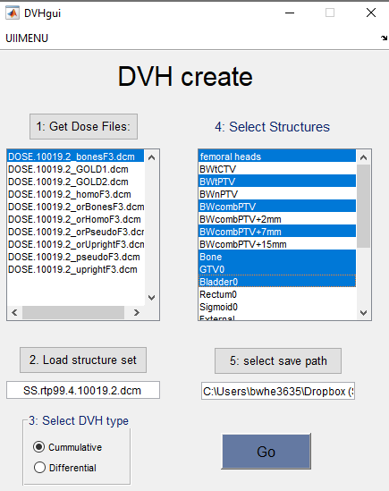

DVH_from_dicomRT
================

Background
----------

This is a simple but hopefully useful piece of code which creates *Dose Volume Histograms* from Dicom-RT files. In particular, it takes one or more dicom dose files as input, exactly one dicom structure file, and loops over all structure files to create DVH files. The output of these dicom files is perfectly set up to use with comp-plan.
A screen shot of the GUI and an explanation of each of it's sections is shown below:

DVH_from_dicomRT screengrabt:

**panels/workflow:**
1. Get Dose files: loads a gui in which the use must select all Dicom-RT dose files. 
2. Load Structure set: loads a gui in which the user must select the structure set associated with the the dose files.
When the structure set is loaded, the code will scan through and load all possibile structures into memory. This can take 
some time for very large structure sets.
3. Select FVH type: Differential or cumulative. (Cumulative is most common in radiotherapy)
4. Select structures: you can manually select the stuctures which you want to create DVHs for.
5. Select save path: loads UI for the user to select a save location. One folder for each dose file will be created. In 
each folder, one excel sheet for each selected contour will be created. 

Shortcomings and limitations
----------------------------

- All dicom files must be from the same patient and in the same coordinate system. Minimal error handling has been 
included here - this is the users responsibility!
- Especially for very small structures, DVH calculation can depend on the histogram binning size. You should compare the output of this code to a clinical system and ensure you are satisfied with the accuracy. 

License conditions
------------------

This code has **not** been cleared for clinical use.
This program is distributed in the hope that it will be useful, but WITHOUT ANY WARRANTY; without even the implied 
 warranty of MERCHANTABILITY or FITNESS FOR A PARTICULAR PURPOSE.
Please refer to the license file for the exact conditions of use. 
